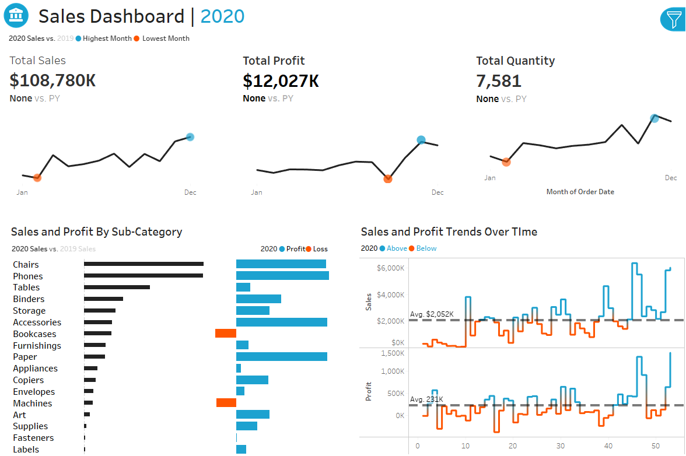

# Sales Dashboard (2020–2023)

An interactive Tableau dashboard to:

- Explore year‑over‑year **Sales**, **Profit**, and **Quantity** trends by month  
- Compare product **Sub‑Categories** across years  
- Analyze weekly performance vs. average  
- Slice by **Product** and **Geography**

---

## 📸 Preview



---

## 🚀 Getting Started

### 1. Clone the repo
```bash
git clone https://github.com/your-username/your-repo-name.git
cd your-repo-name
````

### 2. Open the dashboard

1. Launch **Tableau Desktop** or **Tableau Public**
2. Open the packaged workbook:

   ```
   workbook/Sales_Dashboard_2020-2023.twbx
   ```

### 3. Swap in your own data 

1. Replace the CSV files in `data/` with your own exports—**keep the same column names & formats**
2. In Tableau’s Data pane, right‑click each data source → **Edit Connection** → point to your new CSV

---

## 📂 Repository Structure

```
your-repo-name/
├── assets/
│   └── Dashboard_Screenshot.png   
│
├── data/
│   ├── Orders.csv                 
│   ├── Customers.csv                
│   ├── Products.csv                 
│   └── Location.csv                 
│
├── workbook/
│   └── Sales_Dashboard.twb          
│
├── LICENSE                        
└── README.md
```

---

## 📝 Dashboard Components

1. **Filter Panel** (top‑right)

   * **Year Selector**: 2020 | 2021 | 2022 | 2023
   * **Product**

     * Category (multi‑select)
     * Sub‑Category (multi‑select)
   * **Location**

     * City (multi‑select)
     * State (single‑select)
     * Region (single‑select)

2. **KPI Cards**

   * Total Sales, Total Profit, Total Quantity for the selected year
   * % change vs. prior year

3. **Monthly Trends**

   * Overlaid line charts: current vs. prior year
   * Highest & lowest months highlighted

4. **Sub‑Category Comparison**

   * Side‑by‑side bars: current vs. prior‑year sales
   * Profit bars (profit vs. loss)

5. **Weekly Trends**

   * Dual charts for weekly Sales & Profit
   * Average line & color‑coding for above/below average

---

## 🛠️ Built With

* **Tableau Desktop 2024.1** (compatible with Tableau Public)

---

## 📄 License

This project is licensed under the **MIT License**.
See [LICENSE](LICENSE) for details.
